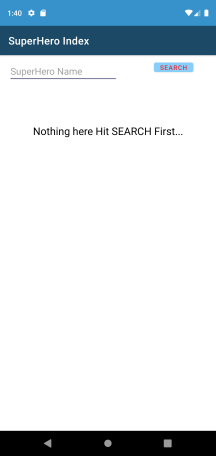

# SuperHero_Index
App to fetch Heroes data from **Superheroapi.com**

Used **Retrofit** to fetch data and display it in **Recyclerview**. Also used **Picasso** to load images from fetched Urls.
In recyclerview item added click listener to open a **Fragment** and display selected heroes description. 

